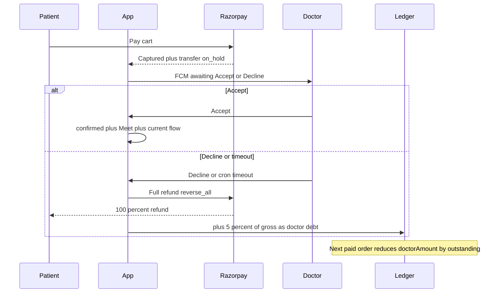

# Doctor Accept/Decline after payment

## Verdict

**Possible.** Do not change how money is captured today. Change **when the booking becomes confirmed** and **how decline is settled**.

Today, [verify-razorpay-payment.ts](supabase/functions/verify-razorpay-payment.ts) sets `bookingStatus: "confirmed"` as soon as payment is captured, and [create-razorpay-order.ts](supabase/functions/create-razorpay-order.ts) already creates a Route transfer with `on_hold: 1`. Doctor payout only happens later via [release-doctor-payment.ts](supabase/functions/release-doctor-payment.ts). That hold is what makes Accept/Decline safe.

**Razorpay Route cannot debit a linked account that has ₹0** (after settlement/withdrawal you get insufficient-balance errors). Your chosen policy is the right one: **always refund the patient in full from the merchant account**, reverse the **held** transfer with `reverse_all: 1`, and **store 5% of the gross paid amount as outstanding doctor debt**, recovered by shrinking the doctor’s share on **future** orders.




## Why a 5% cash pull on this payment cannot work

On this booking the doctor **has not received spendable Route balance**. Funds sit on hold. A full patient refund must **reverse that hold** so the merchant can pay the customer. After `reverse_all`, there is nothing left on this transfer to take as a fine.

So the 5% is a **platform penalty ledger**, not a Razorpay debit of this payment:

- Gross example: patient paid ₹1000 → penalty ₹50.
- Refund: patient gets ₹1000; held doctor share returns to merchant.
- Doctor `outstandingPenalty` += ₹50.
- Next booking of ₹2000 at 85% split: doctor transfer ₹1700 − ₹50 = ₹1650; platform keeps the extra ₹50; outstanding becomes ₹0.

If outstanding is larger than the next doctor share, take the whole share and keep the remainder on the ledger.

## Who owns the ledger: Supabase, not Razorpay

**Razorpay will not track “this doctor owes 5%.”** Route only does what we send on each order:

- capture patient payment
- transfer `amount` to the linked account (`on_hold: 1`)
- refund / reverse that transfer when we call refund

It has **no penalty balance, no debt, no “recover from next booking.”** If we create the next order with the usual 85/15 split, Razorpay will pay 85% again and the 5% is never collected.

**You manage the ledger in Supabase** (`doctor.outstandingPenaltyAmount`). Your Edge Function **decides** the split **before** calling Razorpay. Razorpay only receives the already-adjusted paise.

### Decide vs divide (next booking)

Same code you already have in [create-razorpay-order.ts](supabase/functions/create-razorpay-order.ts): `doctorAmountPaise = floor(cartPaise * splitPercent / 100)`. Then apply ledger:

```text
grossPaise        = cart total (what patient pays)          // unchanged
normalDoctorPaise = floor(grossPaise * percentageSplit / 100)
outstandingPaise  = doctor.outstandingPenaltyAmount * 100   // from Supabase
clawbackPaise     = min(outstandingPaise, normalDoctorPaise)
doctorTransfer    = normalDoctorPaise - clawbackPaise       // send this to Route
platformKeeps     = grossPaise - doctorTransfer             // remainder, including clawback
```

- **Patient still pays 100%** of the session. Do not add the penalty onto the patient.
- **Razorpay transfer `amount` = `doctorTransfer`** (smaller than usual). Platform share is whatever is not transferred — that is how you “collect” the 5%.
- **Do not reduce `outstandingPenaltyAmount` when the order is created.** Only after payment is **captured** in [verify-razorpay-payment.ts](supabase/functions/verify-razorpay-payment.ts): `outstanding -= clawback` (floor at 0). If checkout is abandoned, debt stays.
- Store `clawbackAmount` on those new booking rows so you know this order already reserved that slice (avoid double-clawback if two carts are open).

### Numeric walkthrough

1. Booking A: patient paid ₹1000, doctor **declines**. Refund ₹1000 to patient. `doctor.outstandingPenaltyAmount = 50`. Razorpay is done with A.
2. Booking B: patient pays ₹2000, doctor split 85%.
   - Normal doctor share = ₹1700
   - Clawback = min(50, 1700) = ₹50
   - Route transfer = ₹1650 (on hold)
   - Platform keeps ₹350 instead of ₹300
   - After B is captured: `outstandingPenaltyAmount = 0`
3. If Booking C is only ₹400 (doctor share ₹340) and outstanding is ₹50: transfer ₹290, outstanding becomes ₹0 after capture.
4. If outstanding is ₹2000 and next share is ₹850: transfer ₹0 (or Razorpay min 1 paise if 0 is rejected — keep 1 paise, clawback rest), outstanding remains ₹1150 until later bookings.

### What you do not do

- Do not call Razorpay to “debit linked account ₹50” for the penalty.
- Do not change the patient’s price.
- Do not rely on dashboard Route reports as the source of debt; **Supabase `doctor.outstandingPenaltyAmount` is the source of truth.** Show it on doctor earnings as “Penalty outstanding.”

## Product rules (locked from your choices)

- After pay: **wait for doctor**. Do not auto-confirm.
- **Accept**: current post-confirm flow unchanged (Meet, WhatsApp, earnings, complete, fund release).
- **Decline or timeout**: full refund of **the whole payment/cart** (all rows sharing `paymentId` / `bulkAppointmentId`) + **5% of gross paid amount** as debt. Timeout treated the same as Decline.
- Default timeout: **2 hours** from `paymentVerifiedAt` (store `doctorResponseDueAt`; make it a constant).
- Existing already-`confirmed` bookings: **no backfill**; only new paid bookings enter this flow.

## Data model

New `BookingStatus.awaitingDoctor` in [lib/utils/enum.dart](lib/utils/enum.dart).

Migration:

- `bookings.doctorResponseDueAt` (timestamptz)
- `bookings.doctorRespondedAt`
- `bookings.doctorResponse` (`accepted` / `declined` / `timeout`)
- `bookings.penaltyAmount` (rupees, 5% of that cart’s gross allocated per row or stored once on all group rows)
- `bookings.penaltyStatus` (`none` / `outstanding` / `collected`)
- `doctor.outstandingPenaltyAmount` (rupees, default 0) — running debt used at order-create time

Keep `paymentStatus: paid` until refund succeeds, then `refunded`.

## Backend changes

**1. After payment — do not confirm**

In [verify-razorpay-payment.ts](supabase/functions/verify-razorpay-payment.ts):

- Set `bookingStatus: "awaitingDoctor"` (not `confirmed`).
- Set `doctorResponseDueAt = now + 2h`.
- **Do not** invoke `create-meet-for-booking` yet.

Flutter [payment_screen.dart](lib/ui/book_session/payment_screen.dart) and booking-detail `_onPaid` currently force `confirmed`; change to `awaitingDoctor`. Update [booking_payment_flow.dart](lib/services/booking_payment_flow.dart) FCM from “Booking confirmed” to “New paid booking — Accept or Decline”.

**2. Accept**

New Edge Function `respond-to-booking` (doctor-only, all IDs in the paid group):

- If `awaitingDoctor` + `paid` + due window still open (or ignore due if they act):
  - `bookingStatus = confirmed`, `doctorResponse = accepted`.
  - Invoke existing `create-meet-for-booking`.
  - Notify patient. Stop.

No Razorpay change. Hold stays until today’s fund-release after complete.

**3. Decline / timeout**

Same function (and a scheduled caller):

- Refund **full remaining captured amount** for that `paymentId` (not the current per-row 48h [initiate-refund.ts](supabase/functions/initiate-refund.ts) path). Use `reverse_all: 1` **while `transferStatus` is not `released`**.
- Mark all group rows `paymentStatus/bookingStatus = refunded`, `doctorResponse = declined|timeout`.
- `penalty = round(grossPaid * 0.05)` (paise-safe).
- Increment `doctor.outstandingPenaltyAmount`.
- FCM + email to patient: declined, full refund initiated.
- Slot frees because occupancy already ignores `refunded` in `getTimeSlotsMaster`.

Do **not** allow Decline after Accept, after `transferStatus === released`, or after complete.

**4. Timeout worker**

New `process-awaiting-doctor-timeouts` Edge Function: select `awaitingDoctor` + `paid` + `doctorResponseDueAt < now()`, run the decline/refund/penalty path with `doctorResponse = timeout`.

Schedule with **Supabase cron** (invoke every 5–10 minutes). Document in [supabase/README.md](supabase/README.md). Client-only timers are not reliable.

**5. Recover debt on the next Route split (your code divides; Razorpay only transfers)**

In [create-razorpay-order.ts](supabase/functions/create-razorpay-order.ts), after computing `doctorAmountPaise`:

- Read `doctor.outstandingPenaltyAmount` from Supabase.
- `clawbackPaise = min(outstandingPaise, doctorAmountPaise)` (if two unpaid carts exist for the same doctor, only apply remaining unused outstanding).
- `doctorAmountPaise -= clawbackPaise` (platform fee rises by the same). This **is** the Route `transfers[].amount`.
- Save `clawbackAmount` on the new booking rows. **Do not** decrement `doctor.outstandingPenaltyAmount` yet.

In [verify-razorpay-payment.ts](supabase/functions/verify-razorpay-payment.ts), after capture:

- `doctor.outstandingPenaltyAmount -= this order’s clawback` (not below 0).
- Mark those bookings’ `penaltyStatus = collected` for the clawback slice.

If the next order is unpaid/failed, outstanding stays.

Doctors with **no future bookings** keep the debt on the doctor row (ops can settle offline). That is the honest Route limitation.

## App UI

Doctor [booking_detail_screen.dart](lib/ui/booking_history/booking_detail_screen.dart): prominent **Accept / Decline** when `awaitingDoctor` + this doctor. Hide complete/no-show/fund-release until confirmed. Confirm dialog on Decline: “Patient gets 100% refund. 5% of the booking amount is charged to your account (now or from future payouts).”

Patient: status copy “Waiting for doctor confirmation” (reuse existing pending strings in [booking_history_controller.dart](lib/ui/booking_history/booking_history_controller.dart)). No Join Meet until confirmed.

Earnings: count `awaitingDoctor` in the “to confirm” bucket, not as settled.

## Edge cases


| Case                              | Handling                                                                                                      |
| --------------------------------- | ------------------------------------------------------------------------------------------------------------- |
| Doctor Route balance ₹0           | Refund still works **while on hold**. Penalty is ledger-only.                                                 |
| Hold already released             | Decline disabled. (Should not happen before Accept.)                                                          |
| Bulk package                      | One Accept/Decline for the whole `paymentId` group.                                                           |
| Razorpay refund fails             | Keep `awaitingDoctor`; show error; retry. Do not mark refunded or add penalty.                                |
| Double tap Accept/Decline         | Server: update only if still `awaitingDoctor`.                                                                |
| Patient cancels while waiting     | Recommend: full refund, **no** 5% penalty (doctor did not decline). Optional follow-up; default include this. |
| Meet / calendar                   | Only after Accept.                                                                                            |
| Slot lock                         | `paid` + not refunded already locks the slot.                                                                 |
| Timeout + doctor taps Accept late | Reject; already refunded.                                                                                     |
| Outstanding > next doctor share   | Take 100% of that transfer; leftover debt remains.                                                            |
| Linked-account debit API          | Do not use. Insufficient-balance failures would block patient refunds.                                        |


## Out of scope

- Changing 85/15 split or fund-release after complete.
- Charging the doctor’s bank directly.
- Auto-reassigning the patient to another doctor (only refund).

## Deploy notes

Deploy `verify-razorpay-payment`, `respond-to-booking`, `create-razorpay-order`, `process-awaiting-doctor-timeouts`; apply SQL migration; enable cron. Test in Razorpay test mode: pay → accept; pay → decline with empty linked account; pay → wait past dueAt; second booking clawback of ₹50.