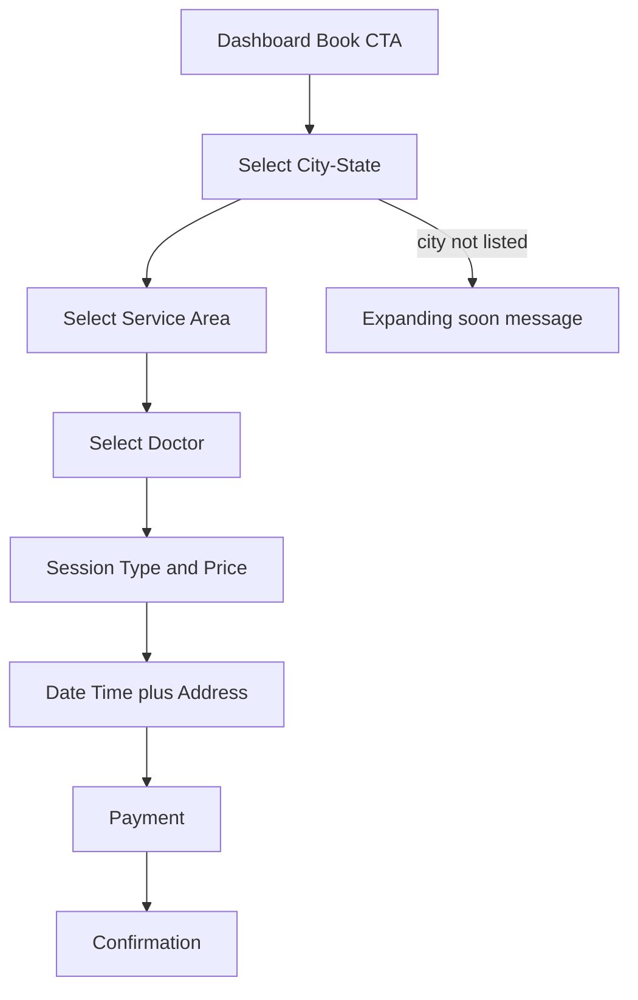

# Service coverage booking UX redesign

## Problem today

Live flow is **Dashboard → Session Type → Date/Time + free address → Pay**, with **Dr. Parul Desai hardcoded** at signup. Anyone in India can book even though service is only Ahmedabad (Paldi / Chandra Nagar).

## Locked UX decision (from you)

Hierarchy patients must follow:

```text
City - State
  → Service area(s)
    → Doctor(s) for that area
      → Session type + price
        → Date / time + visit address
          → Payment → Confirm
```

Example data shape you described:

- **Ahmedabad - Gujarat** → Paldi / Chandranagar → Dr. Parul Desai; South Bopal / Shela / Ghuma → Dr. Janki Janani
- **Surat - Gujarat** → Near 5 km of Adajan → Dr. Kinjal Shah
- **Pune - Maharashtra** → Near 5 km of Kothrud → Dr. Harsh Shah

**Out-of-coverage default:** Cities not published simply do not appear. Footer copy: “Don’t see your city? We currently serve selected areas and are expanding.” No Online/waitlist in this phase.

## Age-inclusive interaction (young + older)

Use **3 progressive full-screen steps** (not deep nested expandables — those are hard for older fingers and small screens), while still matching your tree:

1. **Select city** — large cards: `Ahmedabad - Gujarat`
2. **Select area** — only areas for that city: `Paldi`, `Near by 5 KM of Adajan`
3. **Select doctor** — only doctors linked to that area: name + years of experience (min 56dp rows, 18sp body text)

Sticky breadcrumb on every step: `Ahmedabad - Gujarat › Paldi › Dr. Parul Desai`

When only **one** city / area / doctor is active (today’s reality), auto-select and skip that step so Ahmedabad users are not forced through empty choice screens.

Search on the city list (optional, large search field) for when you have many cities later.




## New booking journey (routes)

Change dashboard FAB from `selectSessionType` to a new first route.


| Step | Screen                                                                              | Route                |
| ---- | ----------------------------------------------------------------------------------- | -------------------- |
| 1    | `[service_city_screen.dart](lib/ui/book_session/service_city_screen.dart)`          | `/selectServiceCity` |
| 2    | `[service_area_screen.dart](lib/ui/book_session/service_area_screen.dart)`          | `/selectServiceArea` |
| 3    | `[select_doctor_screen.dart](lib/ui/book_session/select_doctor_screen.dart)`        | `/selectDoctor`      |
| 4    | Existing `[session_type_screen.dart](lib/ui/book_session/session_type_screen.dart)` | `/selectSessionType` |
| 5+   | Existing date/time → payment → confirm                                              | unchanged            |


Update `[route_module.dart](lib/route/route_module.dart)` and all Book CTAs in `[dashboard_screen.dart](lib/ui/dashboard/dashboard_screen.dart)` / booking history empty state.

## Database design

New migration under `supabase/migrations/` (restore/replace the missing coverage SQL).

**Masters**

- `service_states` — `id`, `name`, `isActive`, `orderBy`
- `service_cities` — `id`, `stateId`, `name`, `isActive`, `orderBy`  
  App display: `"{cityName} - {stateName}"` (e.g. `Ahmedabad - Gujarat`)
- `service_areas` — `id`, `cityId`, `name`, `latitude`, `longitude`, `radiusKm` (nullable; used for “Near by 5 KM of Adajan”), `isActive`, `orderBy`
- `doctor_service_areas` — `id`, `doctorId`, `serviceAreaId`, `isActive`  
  Supports many areas → one doctor (Paldi + Chandranagar both → Parul) and later many doctors per area.

**Doctor table ALTER**

- Ensure `experience` stays the source for “6 Years of experience” copy (already on `[doctor_model.dart](lib/model/doctor_model.dart)`)
- Optional: `latitude` / `longitude` for future nearest-doctor ranking (not required for v1 tap-to-select)

**Bookings ALTER**

- `cityId`, `areaId`, `serviceAreaId` (FKs)
- Keep existing `doctorId`, `doctorJson`, `address`, `latLong` snapshots
- Snapshot extras in JSON or columns: `cityName`, `areaName` so history stays readable if coverage edits later

**Session types (phase 1)**

- Keep global `[session_type](lib/model/session_type_model.dart)` list + prices after doctor is chosen
- Filter only `isActive = true`
- Phase 2 (later, not in this build): per-doctor prices via `doctor_session_type` if needed

**Time slots (phase 1 hardening)**

- Mark booked slots **per doctor + date** (not globally), so multi-doctor cities do not block each other
- Optional later: `time_slot.serviceAreaId` / doctor-specific slots

**Seed for go-live (Ahmedabad only)**

- Gujarat → Ahmedabad → areas Paldi, Chandranagar → `doctor_service_areas` for Dr. Parul
- Leave Surat/Pune rows `isActive = false` until doctors are onboarded

## App / controller changes

`[booking_controller.dart](lib/ui/book_session/booking_controller.dart)`

- Add: `selectedCity`, `selectedArea`, `selectedDoctor`
- Load cities → areas by `cityId` → doctors via `doctor_service_areas`
- Stop reading hardcoded signup doctor for new bookings; use `selectedDoctor`
- Persist coverage IDs on `createPendingBookingBeforePayment`

`[supabase_controller.dart](lib/supabase/supabase_controller.dart)`

- `getServiceCities()`, `getServiceAreas(cityId)`, `getDoctorsForArea(areaId)`
- Slot fetch: filter availability by selected `doctorId` + date

`[signup_controller.dart](lib/ui/signUp/signup_controller.dart)`

- Remove hardcoded `doctorId: 1` / `Dr. Parul Desai` for patients (doctor assigned only at booking)
- Optional: remember last booked city on user profile (`cityId` / `cityName` already reserved in `[database_schema.dart](lib/utils/database_schema.dart)`)

Models + `database_schema` constants for new tables/columns; run `build_runner` for `.g.dart`.

## Date/time screen tweaks

On `[date_time_screen.dart](lib/ui/book_session/date_time_screen.dart)`:

- Show selected city / area / doctor summary at top
- Keep address + GPS for the visit pin
- Soft validate: if area has `lat/lng/radiusKm`, warn when GPS is outside radius (allow continue with confirm dialog so older users are not blocked by GPS errors)

## What users outside Ahmedabad experience

They open Book → see only published cities (today: Ahmedabad - Gujarat). If they expected Surat/Pune, those appear only after you activate rows + doctor links. No path to pay for an unsupported area.

## Implementation order

1. SQL migration + Ahmedabad seed + schema constants
2. Dart models + Supabase fetch APIs
3. Three selection screens + routes + booking controller state
4. Wire session type → date/time → booking create with coverage + doctor
5. Per-doctor slot booking check; remove signup doctor hardcode
6. History/detail: show city, area, doctor clearly

## Out of scope for this pass

- Online / video sessions for pan-India
- Per-doctor custom price lists
- Admin CMS UI (publish via Supabase/SQL using updated README checklist)

